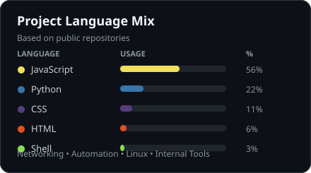

<h1 align="left">Welcome to David's GitHub!</h1>

    

 

  Just a place to share my projects, scripts, and technical growth.
    
  "Always measure an obstacle next to the size of the dream you're pursuing."
    
  - Bill Vaughan

<h2 align="left">About Me</h2>

  I'm a hands-on network technician focused on networking, Linux, automation, and practical tools that solve real workflow problems.
    
  I use this GitHub to document what I'm building, what I'm learning, and the scripts or applications I create along the way. A lot of my projects come from real technical problems I run into while troubleshooting, improving workflows, or building better internal tools.
    
  Currently working with Python, JavaScript, Next.js, Docker, PostgreSQL, Linux, and Bash while continuing to grow deeper in networking and infrastructure.

  

<h2 align="left">Languages and Tools</h2>

  
  
  
  
  
  
  
  
  
  
  
  
  
  
  
  
  
  
  
  
  

